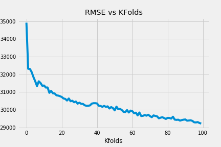

# *Predicting House Prices*

***In this mini-project, we will predict a House's Sale Price. We will be using Ames Housing Dataset, it has information about each house such as Lot Area, Garage Area, Year Built, and more.   We will cover concepts like `Linear Regression, Feature Engineering, Hyperparameter Tuning, RMSE, Cross Validation.`***

View this notebook on [nbviewer](https://nbviewer.jupyter.org/github/nveenverma/nveenverma.github.io/blob/master/Predicting%20House%20Prices/main.ipynb)

--- 

Following Packages and Concepts are explored:

- *Pandas - DataFrame (Consolidating Data)*
- *Matplotlib - Visualisation*
- *Scikit-Learn - Modelling and Prediction*

---

> RMSE Scores  
